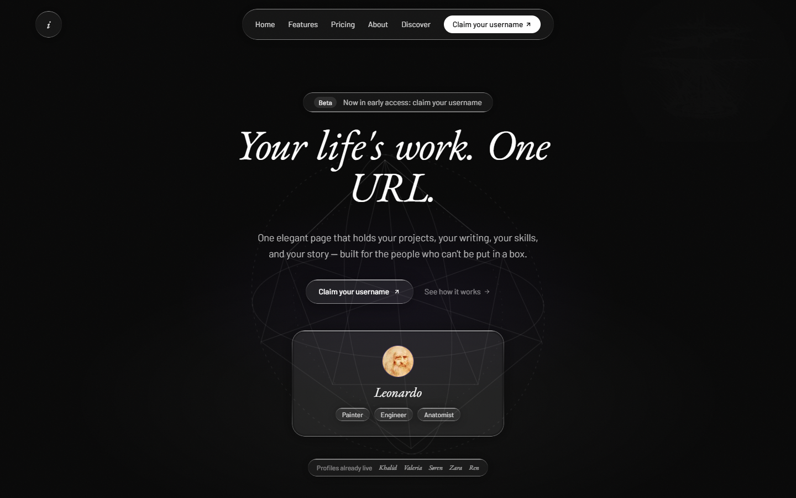
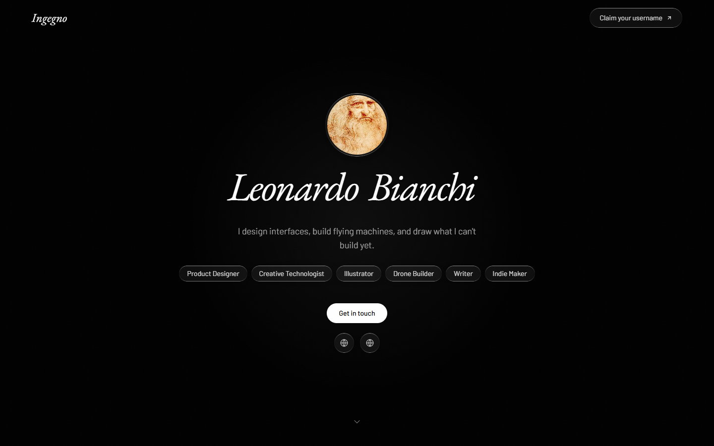

<div align="center">

# Ingegno

**Your work, finally visible.**

One elegant page that holds your projects, your writing, your skills, and your story —
built for the people who can't be put in a box.

[ingegno.app](https://ingegno.app) · [Live demo profile](https://ingegno.app/leonardo) · [Pricing](https://ingegno.app/#pricing)




</div>

---

## Why Ingegno

Founders, student entrepreneurs, and multi-disciplinary creators have a problem no
existing tool solves: their work lives in five different places and none of them tells
the whole story. Linktree is a list of links. Portfolios are single-discipline. Notion
pages look like documents.

Ingegno gives every *ingegno* — the Renaissance word Leonardo used for the creative
intelligence that connects disciplines — a single premium URL:

```
ingegno.app/you
```

A public profile that reads like a narrative, not a résumé: who you are, what you're
building, what you've shipped, and what you're thinking about — kept alive by your
actual activity instead of a static snapshot.

<div align="center">

</div>

## Features

**Public profile**
- Multi-tenant profiles at `ingegno.app/username`, server-rendered with per-profile Open Graph images
- Hero with roles, bio, avatar, and contact — plus a narrative section that connects your disciplines
- Project showcase with cover images, tags, and links
- Live activity feed combining GitHub commits and manual updates
- Social links, "Get in touch" email contact, share link + QR code

**Build in public**
- GitHub OAuth connection with one-click commit sync — your profile stays current
- Manual updates with image attachments for the work that doesn't live in a repo

**Dashboard**
- Auth-protected editor: profile, narrative, projects, updates, and settings
- Onboarding checklist that walks new users to a publishable profile
- Public/private toggle — nothing is visible until you decide it is

**Privacy & account control**
- Full data export (JSON) and one-click account deletion (GDPR)
- Row Level Security on every table — users can only touch their own data
- Rate limiting and input sanitization on all public-facing surfaces

## Pricing

| | Free | Pro — €9/mo or €79/yr |
|---|---|---|
| Public profile | ✓ | ✓ |
| GitHub sync + updates | ✓ | ✓ |
| Visible projects | 2 | Unlimited |
| "Made with Ingegno" badge | Shown | Removed |

## Tech stack

| Layer | Technology |
|---|---|
| Framework | Next.js 16 (App Router, Server Components + Server Actions) |
| UI | React 19 · Tailwind CSS v4 · Framer Motion |
| Database & Auth | Supabase (Postgres, Auth, Storage, Row Level Security) |
| Integrations | GitHub OAuth (commit sync) · Resend (transactional email) |
| OG images | `@vercel/og` (edge runtime) |
| Hosting | Vercel |
| Language | TypeScript |

Design direction: dark-first, editorial. EB Garamond italics against Barlow body text,
liquid-glass surfaces, and real Da Vinci artwork (public domain) — Renaissance meets
modern product.

## Local development

```bash
git clone https://github.com/trustinraul/p4-ingegno.git
cd p4-ingegno
npm install

cp .env.local.example .env.local   # fill in the values below

npm run dev
```

Open [http://localhost:3000](http://localhost:3000).

### Environment variables

| Variable | Description |
|---|---|
| `NEXT_PUBLIC_SUPABASE_URL` | Supabase project URL |
| `NEXT_PUBLIC_SUPABASE_ANON_KEY` | Supabase anon/public key |
| `SUPABASE_SERVICE_ROLE_KEY` | Service role key — server-only, never shipped to the client |
| `NEXT_PUBLIC_SITE_URL` | Base URL of the deployment (auth + OAuth redirects) |
| `NEXT_PUBLIC_GITHUB_CLIENT_ID` | GitHub OAuth app client ID (public) |
| `GITHUB_CLIENT_ID` | GitHub OAuth app client ID |
| `GITHUB_CLIENT_SECRET` | GitHub OAuth app client secret — server-only |
| `RESEND_API_KEY` | Resend API key for transactional email |
| `EMAIL_FROM` / `EMAIL_REPLY_TO` | Sender identity for transactional email |

Database schema and policies live in [supabase/](supabase/); migrations are applied
through the Supabase CLI.

```bash
npm run test    # vitest
npm run lint    # eslint
npm run build   # production build
```

## Roadmap

- Custom domains for profiles
- Profile visit analytics
- Automatic GitHub sync via webhooks
- Founder Pack — locked-in pricing for early adopters

---

<div align="center">

Built by [Raúl Calvo](https://github.com/trustinraul) · [ingegno.app](https://ingegno.app)

</div>
